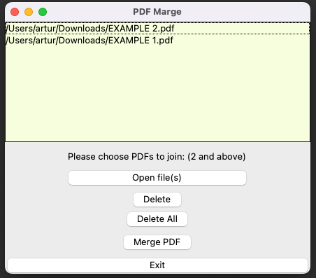
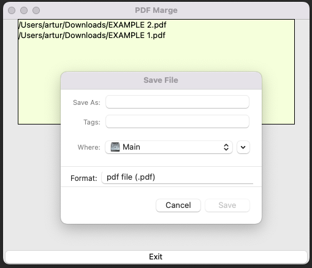

# Marge PDF

## Table of contents

* [General info](#general-info)
* [Technologies](#technologies)
* [Setup](#setup)

***
## General info
I have prepared applications to marge PDF files.
I used python GUI interface, tkinter package and PyPDF.
The application is very easy to use.
***
## Technologies

* Python version 3.6 (use tkinter and PyPDF)
***
## Setup

```
# 1. To run this project, create a virtual environment and clone the repository.
$ https://github.com/Trzups/MergerPDF.git

# 2. Activate the virtual environment
$ source virtualenv/bin/activate

# 3. Then go to the folder :
$ MergerPDF

# 4. Using:
$ pip3 install -r requirements.txt

# 5. And start project:
$ python3 main.py
```
***
<p align="center">
    After starting the application, add the files you want to join<br />
    
</p>
<p align="center">
    Then choose where you want to save the new file<br />
  
</p>
